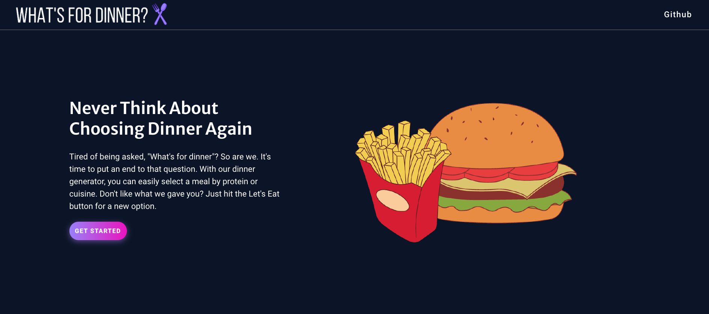
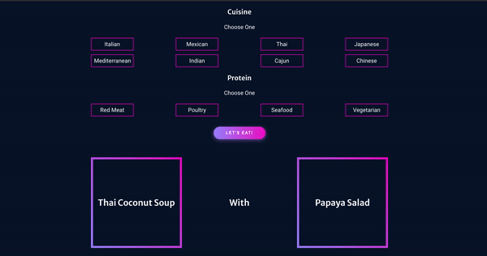

<h1 align= "center">
What's For Dinner?
</h1>

  <a href="https://github.com/sarahdepalo/whats-for-dinner-backend"><strong>What's For Dinner API Docs »</strong></a>

*What's For Dinner?* was a fun side project made primarily for personal use after getting tired of sitting in agony when I couldn't figure out what to make for dinner and needed some inspiration. This web app allows users to narrow done their dinner ideas by cuisine and/or protein. Users can also hit the *Let's Eat* button for a truly random dinner idea. 

My main focus for this app was writing cleaner CSS and making something that was responsive without having to write a bunch of media queries. I also wanted a shot at creating my own little API.

Find out what's for dinner [here](https://whats-4-dinner.netlify.app/).

## Screenshots

## Technologies

* PostgreSQL
* Express
* React
* Node.js
* Sass

## Goals
* Adding links to recipes for each item
* Giving the user the ability to select an entree or side they want to keep and just randomize the other option instead of randomizing both on each click. 
* Adding a fun animation before the dinner idea is generated. 
* Adding more entrees and sides! 